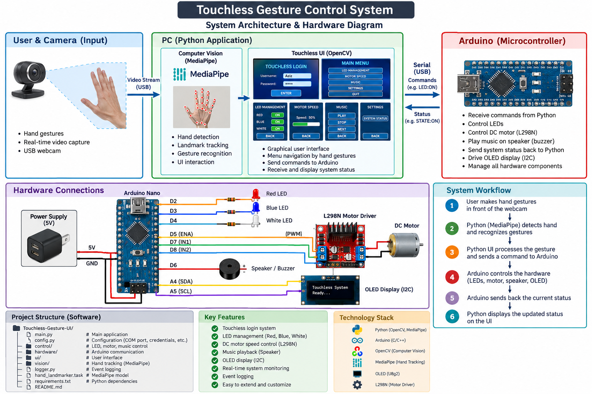

# Touchless Gesture UI

A real-time **touchless human-machine interface** based on computer vision and embedded systems.  
The user interacts with a graphical interface using the **index finger detected by a webcam**, while an Arduino Nano controls the physical hardware.

## 🏗️ System Architecture



The complete system combines:

- Python / OpenCV
- MediaPipe Hand Tracking
- Arduino Nano
- OLED I2C display
- Red, Blue and White LEDs
- L298N motor driver + DC motor
- Speaker / buzzer
- USB Serial communication

### System workflow

```text
Webcam
   │
   ▼
MediaPipe Hand Tracking
   │
   ▼
Index Finger Position
   │
   ▼
Python / OpenCV Touchless UI
   │
   │ USB Serial
   ▼
Arduino Nano
   │
   ├── OLED Display
   ├── Red LED
   ├── Blue LED
   ├── White LED
   ├── L298N → DC Motor
   └── Speaker / Buzzer
```


## 🔐 Login Configuration

The default credentials are:

```text
Username: Aziz
Password: 1234
```

To change them, open:

```text
main.py
```

and modify:

```python
USERNAME = "Aziz"
PASSWORD = "1234"
```

For example:

```python
USERNAME = "YourUsername"
PASSWORD = "YourPassword"
```

> **Security note:** Credentials are currently stored directly in `main.py` for this local prototype. For a production application, use environment variables or another secure authentication mechanism.

---

## 🔌 Arduino COM Port

The default serial configuration is:

```python
COM_PORT = "COM6"
BAUD_RATE = 9600
```

If your Arduino is connected to another port, change `COM_PORT` in `main.py`.

Example:

```python
COM_PORT = "COM5"
```

### Find your COM port on Windows

1. Connect the Arduino Nano.
2. Open Arduino IDE.
3. Go to **Tools → Port**.
4. Identify the Arduino port.
5. Update `COM_PORT` in `main.py`.

> **Important:** Close the Arduino Serial Monitor before starting the Python application.

---

## ⚡ Hardware Connections

| Component | Arduino Nano |
|---|---:|
| Red LED | D2 |
| Blue LED | D3 |
| White LED | D4 |
| L298N ENA | D5 (PWM) |
| Speaker / Buzzer | D6 |
| L298N IN1 | D7 |
| L298N IN2 | D8 |
| OLED SDA | A4 |
| OLED SCL | A5 |

### L298N + DC Motor

```text
Arduino D5 → ENA
Arduino D7 → IN1
Arduino D8 → IN2

L298N OUT1 / OUT2 → DC Motor
```

Remove the ENA jumper when using PWM from D5.

Use an appropriate external power supply for the motor through the L298N.

### Speaker / Buzzer

```text
Arduino D6 → Speaker/Buzzer +
Arduino GND → Speaker/Buzzer -
```

A larger speaker should use an appropriate amplifier/driver.

### OLED

```text
OLED SDA → A4
OLED SCL → A5
OLED VCC → 5V
OLED GND → GND
```

---

## 🖐️ Touchless Interface

### Login

The login page contains:

- Username
- Password
- Virtual keyboard
- Delete
- Enter

The **USERNAME** and **PASSWORD** fields use a **0.20 second hover delay** to prevent accidental switching when the hand passes over them.

Virtual keyboard keys and DELETE use a longer hover delay.

### Main Menu

```text
LED MANAGEMENT
MOTOR SPEED
MUSIC
SETTINGS
QUIT
```

### LED Management

Controls:

```text
RED
BLUE
WHITE
BACK
```

### Motor Speed

The index finger controls a horizontal speed slider from:

```text
0 → 100 km/h
```

The requested speed is converted into PWM control for the L298N.

### Music

Controls:

```text
PLAY
STOP
NEXT
BACK
```

Music is generated by the Arduino through the connected speaker/buzzer.

### Settings

The Settings page provides access to:

```text
SYSTEM STATUS
BACK
```

The System Status page displays:

- Arduino connection
- Hand detection
- Hand confidence
- FPS
- LED states
- Motor speed
- Music state
- Last action
- Event log

---

## 🛑 Motor Safety

If the system is on the Motor page and the hand is lost for approximately:

```text
0.50 seconds
```

Python automatically sends:

```text
SPEED:0
```

to the Arduino.

This provides an automatic motor stop when the user's hand is no longer detected.

---


## 🧰 Technologies

| Technology | Role |
|---|---|
| Python | Main application |
| OpenCV | Graphical UI + camera |
| MediaPipe Tasks | Hand tracking |
| Arduino Nano | Hardware controller |
| C/C++ | Arduino firmware |
| U8g2lib | OLED control |
| OLED I2C | Hardware display |
| L298N | DC motor driver |
| USB Serial | Python ↔ Arduino communication |

---

## 📦 Installation

Clone the repository:

```bash
git clone https://github.com/Abdelaziz-elfarjaoui/Touchless-Gesture-UI.git
cd Touchless-Gesture-UI
```

Install dependencies:

```bash
pip install -r requirements.txt
```

Make sure the MediaPipe model is present:

```text
hand_landmarker.task
```

---

## ▶️ Run

Connect the webcam and Arduino hardware, then run:

```bash
python main.py
```

On Windows PowerShell:

```powershell
python .\main.py
```

---


## 👨‍💻 Author

**Abdelaziz El Farjaoui**

Touchless Gesture UI — Embedded Systems / Computer Vision Project

📧 **Email:** abdelazizelfarjaoui@gmail.com

---

## 📄 License

This project is intended for educational and research purposes.
